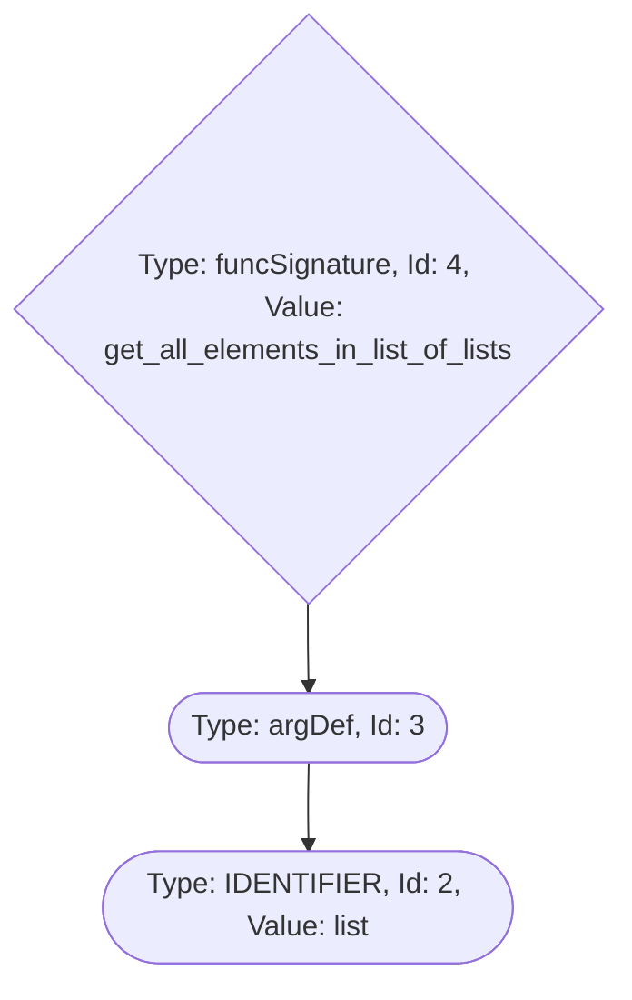

```mermaid
flowchart TB
node4([Type: funcSignature, Id: 4, Value: get_all_elements_in_list_of_lists]) --> node3([Type: argDef, Id: 3])
node3([Type: argDef, Id: 3]) --> node2([Type: IDENTIFIER, Id: 2, Value: list])
node4{Type: funcSignature, Id: 4, Value: get_all_elements_in_list_of_lists}
```
